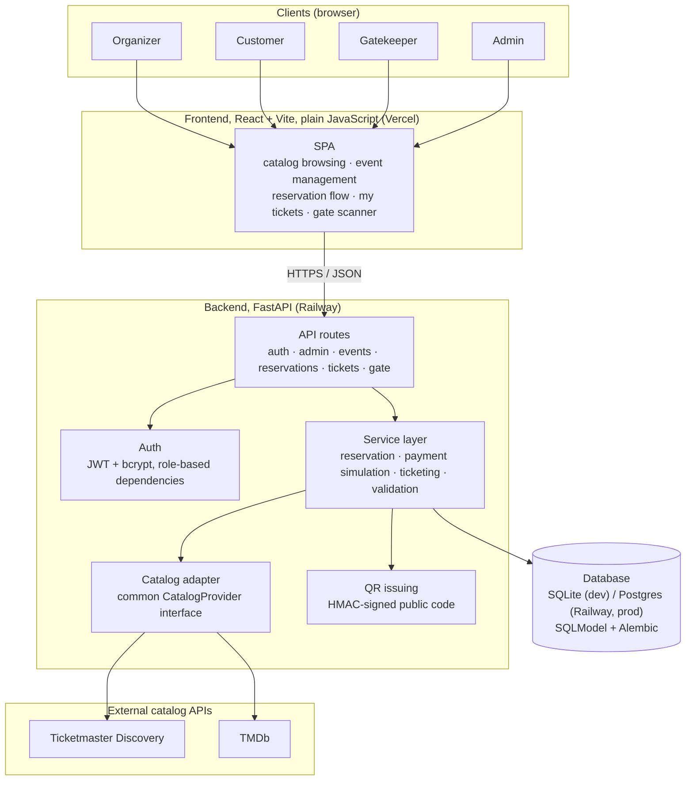

# Tiquetly

An events and ticketing platform with three roles: organizer, customer,
and gatekeeper. The organizer builds events from an external catalog
(shows via Ticketmaster, movies via TMDb), the customer browses, reserves
a spot, and pays through a simulated flow, and the gatekeeper validates
the ticket at the door.

🇧🇷 [Leia em português](README.pt-BR.md)

## Contents

- [Stack](#stack)
- [Architecture](#architecture)
- [Running the project](#running-the-project)
- [Environment variables](#environment-variables)
- [Test data (seed)](#test-data-seed)
- [Walking through the full flow](#walking-through-the-full-flow)

## Stack

- Backend: Python 3.12, FastAPI, SQLModel on top of SQLAlchemy, Alembic
  for migrations. SQLite in development, Postgres in production.
- Frontend: React with Vite, plain JavaScript (no TypeScript), React
  Router. Custom CSS, no UI kit.
- Authentication: JWT (`python-jose`) and password hashing with bcrypt
  (`passlib`).
- Development environment: devcontainer (Python 3.12 + Node 20 via
  feature).

## Architecture



- The SPA never talks to Ticketmaster or TMDb directly; every catalog
  lookup goes through the backend, the only place holding the external
  API keys.
- `catalog` normalizes both external sources behind one interface
  (`CatalogProvider`) before anything else in the backend sees them,
  dispatched by category from a single `GET /catalog/search` endpoint.
- The one guarantee the whole project depends on: a seat, or a unit of
  general-admission capacity, is never sold twice, even under
  concurrent requests. Both reservation modes resolve this the same
  way, one `UPDATE` whose own `WHERE` clause re-checks availability and
  applies the change atomically, never a separate read followed by a
  separate write with a gap in between for another request to land in.
- Symmetrical guarantee on the gate side: the same ticket code
  transitions from valid to used exactly once, guarded the same way.
- No real-time seat map or availability channel: the guarded `UPDATE`
  above is the actual guarantee, a live-updating screen would only be a
  UX nicety on top of it, not a substitute for it. The full reasoning
  for every choice on this page, including the ones considered and
  discarded, is kept in a separate set of engineering notes, not part
  of this repository.
- Deploy topology: static frontend build on Vercel
  ([tiquetly.vercel.app](https://tiquetly.vercel.app)), backend + a
  managed Postgres instance on Railway, one service each. Local
  development runs the whole stack (backend, frontend, SQLite file)
  inside the devcontainer, no external services required except the two
  catalog API keys.

## Running the project

### With the devcontainer (recommended)

1. Open the folder in VS Code. If the Dev Containers extension is
   installed, a prompt should offer to open it in the container: from
   that prompt or the command palette (`Ctrl+Shift+P` / `Cmd+Shift+P`),
   choose **Dev Containers: Rebuild and Reopen in Container** the first
   time (builds the image from scratch). After that, **Reopen in
   Container** is enough. `devcontainer up` from the CLI also works.
   Backend and frontend dependencies are installed automatically by
   `postCreateCommand`.
2. Copy `backend/.env.example` to `backend/.env` and fill in the API
   keys (see [Environment variables](#environment-variables)).
3. Run the migrations and start both servers:

   ```
   cd backend
   .venv/bin/alembic upgrade head
   .venv/bin/uvicorn app.main:app --reload --port 8000 --host 0.0.0.0
   ```

   ```
   cd frontend
   npm install
   npm run dev
   ```

   The backend's `--host 0.0.0.0` is required for VS Code's automatic
   port forwarding to work from outside the container (the frontend
   already handles this on its own, `vite.config.js` sets
   `server.host = true`). Without that flag the server still starts
   fine, but nothing opens in the host browser.

4. Backend at http://localhost:8000 (interactive docs at `/docs`),
   frontend at http://localhost:5173.

### Without the devcontainer

Requires Python 3.12+ and Node 20+ installed on the machine.

```
cd backend
python3 -m venv .venv
.venv/bin/pip install -r requirements.txt
cp .env.example .env   # fill in the API keys
.venv/bin/alembic upgrade head
.venv/bin/uvicorn app.main:app --reload --port 8000
```

```
cd frontend
npm install
npm run dev
```

### With Docker Compose

An alternative that doesn't depend on installing Python/Node on the
machine: brings up backend, frontend, and a real Postgres (not the
local dev SQLite) in three containers. Works both outside the
devcontainer (any machine with
Docker and Docker Compose installed) and from inside it, since the
devcontainer has the `docker-in-docker` feature enabled.

```
cp .env.example .env   # fill in the API keys and change the secrets
docker compose up --build
```

Frontend at http://localhost:5173, backend at http://localhost:8000.
Doesn't seed test data on its own; run the seed by hand once all three
services are up, if you want it:

```
docker compose exec backend python -m app.seed
```

`docker compose down` stops the stack; `docker compose down -v` also
drops the Postgres volume, for a clean slate.

## Environment variables

Backend (`backend/.env`, see `backend/.env.example`):

| Variable | Description |
| --- | --- |
| `DATABASE_URL` | Defaults to local SQLite, no setup needed. |
| `FRONTEND_ORIGIN` | Origin allowed by CORS, needs to match wherever the frontend runs. |
| `JWT_SECRET_KEY` | Secret for auth tokens. Generate your own value. |
| `QR_HMAC_SECRET` | Secret for the ticket QR signature. Generate your own value. |
| `TICKETMASTER_API_KEY` | Generate at [developer.ticketmaster.com](https://developer.ticketmaster.com). |
| `TMDB_API_KEY` | Generate at [developer.themoviedb.org](https://developer.themoviedb.org). |

Frontend (`frontend/.env`, see `frontend/.env.example`):

| Variable | Description |
| --- | --- |
| `VITE_API_URL` | Backend URL. The default already covers the local setup. |

Docker Compose (root `.env`, see [`.env.example`](.env.example), only
used by [`docker compose up`](#with-docker-compose)): the same six
variables above, plus the three below that assemble the compose
Postgres `DATABASE_URL`.

| Variable | Description |
| --- | --- |
| `POSTGRES_USER` | Compose Postgres user. |
| `POSTGRES_PASSWORD` | Compose Postgres password. |
| `POSTGRES_DB` | Compose Postgres database name. |

## Test data (seed)

With the migrations applied and the API keys filled in, run:

```
cd backend
.venv/bin/python -m app.seed
```

Creates (or reuses, if they already exist: safe to run more than once)
an organizer, two customers, a gatekeeper account, one published show
event (Ticketmaster), and one movie event (TMDb) with seats, with one of
the movie tickets already validated (so the gate screen has an
"already used" case to show, not just the happy path). The script calls
the real Ticketmaster and TMDb, the same path the organizer would use
through the screen, so both API keys need to be configured before
running it.

Credentials (same password for everyone, just to make testing easier):

| Role | Email | Password |
| --- | --- | --- |
| Admin | `admin@tiquetly.com` | `tiquetly123` |
| Organizer | `organizador@tiquetly.com` | `tiquetly123` |
| Customer 1 | `cliente1@tiquetly.com` | `tiquetly123` |
| Customer 2 | `cliente2@tiquetly.com` | `tiquetly123` |
| Gatekeeper | `portaria@tiquetly.com` | `tiquetly123` |

## Walking through the full flow

After the seed, at http://localhost:5173:

1. **Organizer** (`organizador@tiquetly.com`): sign in, go to
   "Meus eventos" (My events), "Criar evento" (Create event) to publish
   another one from the catalog, or edit/unpublish the two that already
   exist.
2. **Customer** (`cliente1@tiquetly.com` or `cliente2@tiquetly.com`):
   search for an event on the home page, open it, reserve (quantity for
   `general` events, seat map for `seatmap` events), pay with the test
   card that approves (`4242 4242 4242 4242`) or the one that declines
   (`4000 0000 0000 0002`, releases the stock again). A pending
   reservation can also be cancelled before paying ("Desistir e
   cancelar reserva", give up and cancel reservation). Once approved,
   the ticket shows up under "Meus ingressos" (My tickets), with a QR
   code, a code to type in at the gate, and a button to copy the public
   sharing link; from there you can also cancel an already-paid
   reservation (releases the ticket and the seat/stock).
3. **Gatekeeper** (`portaria@tiquetly.com`): sign in, go to "Portaria"
   (Gate), pick today's event, validate by camera or by typing the code
   in. One ticket from the seeded movie event already shows as
   "already used" so you can test that outcome without validating the
   same ticket twice by hand.
4. **Admin** (`admin@tiquetly.com`, optional): sign in, go to "Admin",
   create a new organizer or gatekeeper account and sign in as it
   right away, no seed script or database access needed.

