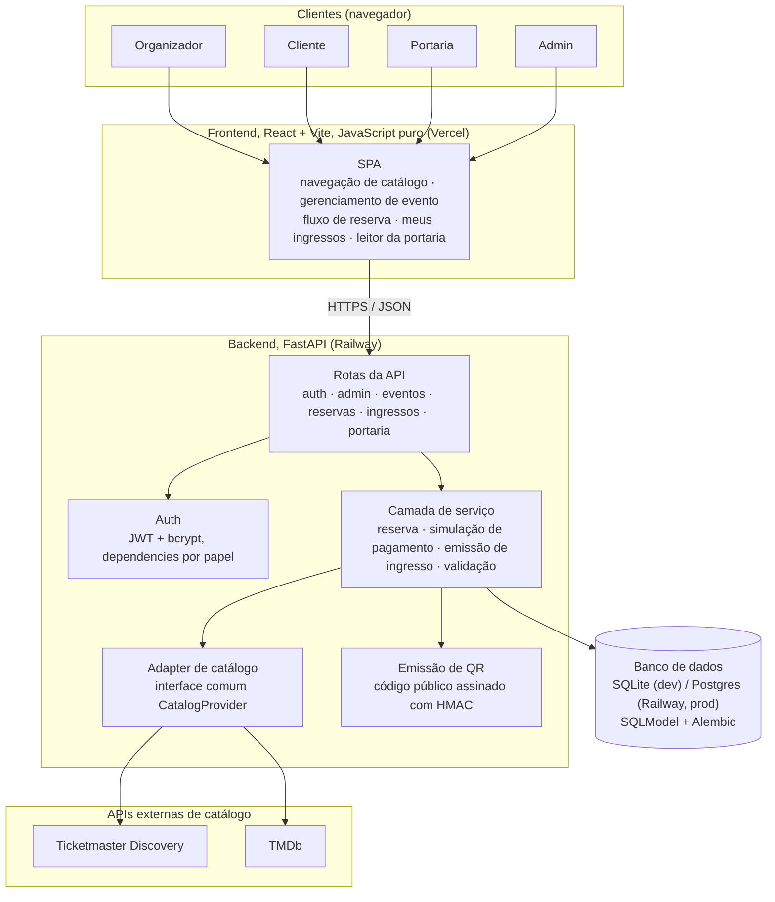

# Tiquetly

Plataforma de eventos e ingressos com três papéis: organizador, cliente e
portaria. O organizador monta eventos a partir de um catálogo externo
(shows via Ticketmaster, filmes via TMDb), o cliente navega, reserva e
paga de forma simulada, e a portaria valida o ingresso na entrada.

🇬🇧 [Read in English](README.md)

## Sumário

- [Stack](#stack)
- [Arquitetura](#arquitetura)
- [Como rodar](#como-rodar)
- [Variáveis de ambiente](#variáveis-de-ambiente)
- [Dados de teste (seed)](#dados-de-teste-seed)
- [Percorrendo o fluxo completo](#percorrendo-o-fluxo-completo)

## Stack

- Backend: Python 3.12, FastAPI, SQLModel sobre SQLAlchemy, Alembic para
  migrações. SQLite em desenvolvimento, Postgres em produção.
- Frontend: React com Vite, JavaScript puro (sem TypeScript), React
  Router. CSS próprio, sem UI kit.
- Autenticação: JWT (`python-jose`) e hash de senha com bcrypt
  (`passlib`).
- Ambiente de desenvolvimento: devcontainer (Python 3.12 + Node 20 via
  feature).

## Arquitetura



- A SPA nunca fala diretamente com a Ticketmaster ou a TMDb; toda busca
  no catálogo passa pelo backend, o único lugar que guarda as chaves das
  APIs externas.
- `catalog` normaliza as duas fontes externas atrás de uma interface só
  (`CatalogProvider`) antes de qualquer outra parte do backend enxergar
  esses dados, despachado por categoria a partir de um único endpoint
  `GET /catalog/search`.
- A garantia da qual o projeto inteiro depende: um assento, ou uma
  unidade de capacidade de admissão geral, nunca é vendido duas vezes,
  mesmo sob requisições concorrentes. Os dois modos de reserva resolvem
  isso do mesmo jeito, um único `UPDATE` cuja própria cláusula `WHERE`
  rechecha a disponibilidade e aplica a mudança de forma atômica, nunca
  uma leitura separada seguida de uma escrita separada com um intervalo
  no meio pra outra requisição ocupar.
- Garantia simétrica do lado da portaria: o mesmo código de ingresso
  transiciona de válido pra usado exatamente uma vez, guardado da mesma
  forma.
- Sem mapa de assentos nem canal de disponibilidade em tempo real: o
  `UPDATE` guardado acima é a garantia de verdade, uma tela que atualiza
  ao vivo seria só um refinamento de UX em cima dela, não um substituto.
  O raciocínio completo de cada escolha desta página, incluindo as
  descartadas pelo caminho, fica num conjunto separado de notas de
  engenharia, fora deste repositório.
- Topologia de deploy: build estático do frontend na Vercel
  ([tiquetly.vercel.app](https://tiquetly.vercel.app)), backend mais uma
  instância gerenciada de Postgres na Railway, um serviço cada. O
  desenvolvimento local roda a stack inteira (backend, frontend, arquivo
  SQLite) dentro do devcontainer, sem nenhum serviço externo necessário
  além das duas chaves de API de catálogo.

## Como rodar

### Com devcontainer (recomendado)

1. Abrir a pasta no VS Code. Se a extensão Dev Containers estiver
   instalada, deve aparecer um aviso oferecendo para abrir no container:
   nesse aviso ou pela paleta de comandos (`Ctrl+Shift+P` /
   `Cmd+Shift+P`), escolher **Dev Containers: Rebuild and Reopen in
   Container** na primeira vez (constrói a imagem do zero). Depois disso,
   **Reopen in Container** já basta. Também dá para usar `devcontainer up`
   pela CLI. As dependências de backend e frontend são instaladas
   automaticamente pelo `postCreateCommand`.
2. Copiar `backend/.env.example` para `backend/.env` e preencher as
   chaves de API (ver [Variáveis de ambiente](#variáveis-de-ambiente)).
3. Rodar as migrações e subir os dois servidores:

   ```
   cd backend
   .venv/bin/alembic upgrade head
   .venv/bin/uvicorn app.main:app --reload --port 8000 --host 0.0.0.0
   ```

   ```
   cd frontend
   npm install
   npm run dev
   ```

   O `--host 0.0.0.0` do backend é necessário para o encaminhamento
   automático de porta do VS Code funcionar de fora do container (o
   frontend já resolve isso sozinho, `vite.config.js` define
   `server.host = true`). Sem essa flag o servidor sobe normalmente, mas
   nada abre no navegador do host.

4. Backend em http://localhost:8000 (docs automáticos em `/docs`),
   frontend em http://localhost:5173.

### Sem devcontainer

Requer Python 3.12+ e Node 20+ instalados na máquina.

```
cd backend
python3 -m venv .venv
.venv/bin/pip install -r requirements.txt
cp .env.example .env   # preencher as chaves de API
.venv/bin/alembic upgrade head
.venv/bin/uvicorn app.main:app --reload --port 8000
```

```
cd frontend
npm install
npm run dev
```

### Com Docker Compose

Alternativa que não depende de instalar Python/Node na máquina: sobe
backend, frontend e um Postgres real (não o SQLite do dev local) em
três containers. Funciona tanto fora do devcontainer (qualquer máquina
com Docker e Docker Compose
instalados) quanto de dentro dele, já que o devcontainer tem a feature
`docker-in-docker` ativada.

```
cp .env.example .env   # preencher as chaves de API e trocar os segredos
docker compose up --build
```

Frontend em http://localhost:5173, backend em http://localhost:8000. Não
sobe com dados de teste sozinho; rodar o seed manualmente depois que os
três serviços estiverem de pé, se quiser:

```
docker compose exec backend python -m app.seed
```

`docker compose down` para a stack; `docker compose down -v` também
apaga o volume do Postgres, para recomeçar do zero.

## Variáveis de ambiente

Backend (`backend/.env`, ver `backend/.env.example`):

| Variável | Descrição |
| --- | --- |
| `DATABASE_URL` | Padrão já usa SQLite local, sem setup nenhum. |
| `FRONTEND_ORIGIN` | Origem liberada no CORS, precisa bater com onde o frontend roda. |
| `JWT_SECRET_KEY` | Segredo dos tokens de autenticação. Gerar um valor próprio. |
| `QR_HMAC_SECRET` | Segredo da assinatura do QR do ingresso. Gerar um valor próprio. |
| `TICKETMASTER_API_KEY` | Gerar em [developer.ticketmaster.com](https://developer.ticketmaster.com). |
| `TMDB_API_KEY` | Gerar em [developer.themoviedb.org](https://developer.themoviedb.org). |

Frontend (`frontend/.env`, ver `frontend/.env.example`):

| Variável | Descrição |
| --- | --- |
| `VITE_API_URL` | URL do backend. O padrão já cobre o setup local. |

Docker Compose (`.env` na raiz, ver [`.env.example`](.env.example), só
usado por [`docker compose up`](#com-docker-compose)): as mesmas seis
variáveis acima, mais as três abaixo que montam o `DATABASE_URL` do
Postgres do compose.

| Variável | Descrição |
| --- | --- |
| `POSTGRES_USER` | Usuário do Postgres do compose. |
| `POSTGRES_PASSWORD` | Senha do Postgres do compose. |
| `POSTGRES_DB` | Nome do banco do Postgres do compose. |

## Dados de teste (seed)

Com as migrações aplicadas e as chaves de API preenchidas, rodar:

```
cd backend
.venv/bin/python -m app.seed
```

Cria (ou reaproveita, se já existirem: seguro rodar mais de uma vez) um
organizador, dois clientes, uma conta de portaria, um evento de show
publicado (Ticketmaster) e um de filme (TMDb) com assentos, sendo que um
dos ingressos do filme já sai validado (para a tela de portaria já ter um
caso de "já utilizado" pra mostrar, não só o caminho feliz). O script usa
a Ticketmaster e a TMDb de verdade, no mesmo caminho que o organizador
usaria pela tela, então as duas chaves de API precisam estar
configuradas antes de rodar.

Credenciais (senha igual pra todo mundo, só pra facilitar o teste):

| Papel | E-mail | Senha |
| --- | --- | --- |
| Admin | `admin@tiquetly.com` | `tiquetly123` |
| Organizador | `organizador@tiquetly.com` | `tiquetly123` |
| Cliente 1 | `cliente1@tiquetly.com` | `tiquetly123` |
| Cliente 2 | `cliente2@tiquetly.com` | `tiquetly123` |
| Portaria | `portaria@tiquetly.com` | `tiquetly123` |

## Percorrendo o fluxo completo

Depois do seed, em http://localhost:5173:

1. **Organizador** (`organizador@tiquetly.com`): entrar, ir em "Meus
   eventos", "Criar evento" para publicar outro a partir do catálogo, ou
   editar/despublicar os dois já existentes.
2. **Cliente** (`cliente1@tiquetly.com` ou `cliente2@tiquetly.com`):
   buscar um evento na home, abrir, reservar (quantidade para eventos
   `general`, mapa de assentos para `seatmap`), pagar com o cartão de
   teste que aprova (`4242 4242 4242 4242`) ou o que recusa
   (`4000 0000 0000 0002`, libera o estoque de novo). Reserva pendente
   também pode ser cancelada antes de pagar ("Desistir e cancelar
   reserva"). Depois de aprovado, o ingresso aparece em "Meus
   ingressos", com QR, código para digitar na portaria e um botão para
   copiar o link público de compartilhamento; de lá também dá para
   cancelar uma reserva já paga (libera o ingresso e o lugar/estoque).
3. **Portaria** (`portaria@tiquetly.com`): entrar, ir em "Portaria",
   escolher o evento do dia, validar por câmera ou digitando o código.
   Um ingresso do evento de filme semeado já sai "já utilizado" para
   testar esse retorno sem precisar validar duas vezes na mão.
4. **Admin** (`admin@tiquetly.com`, opcional): entrar, ir em "Admin",
   criar uma conta nova de organizador ou portaria e já logar com ela
   na hora, sem precisar de script de seed nem acesso ao banco.

